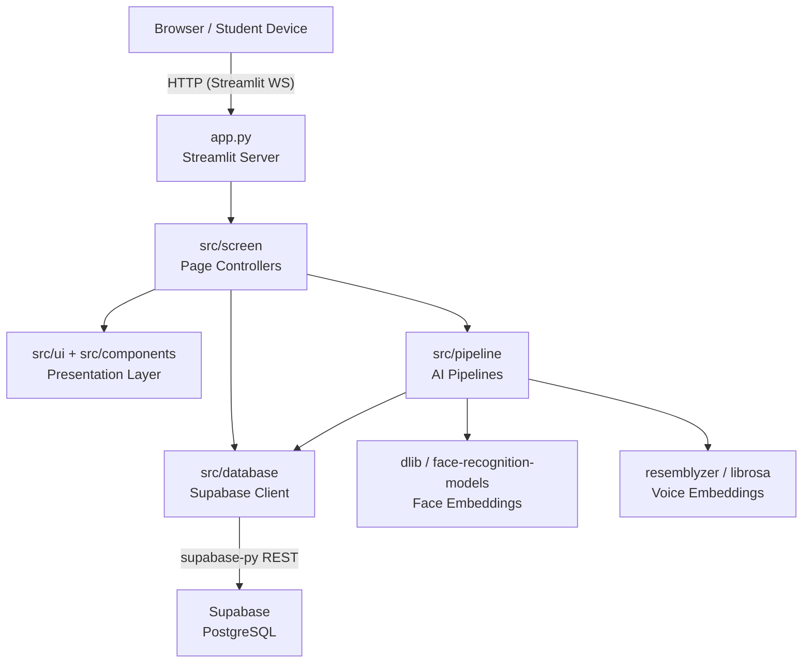
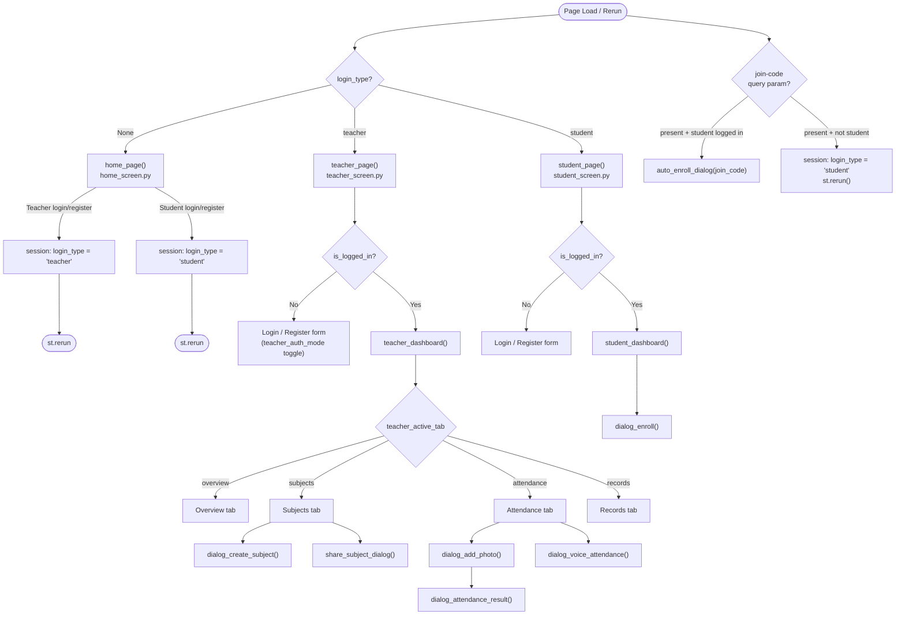
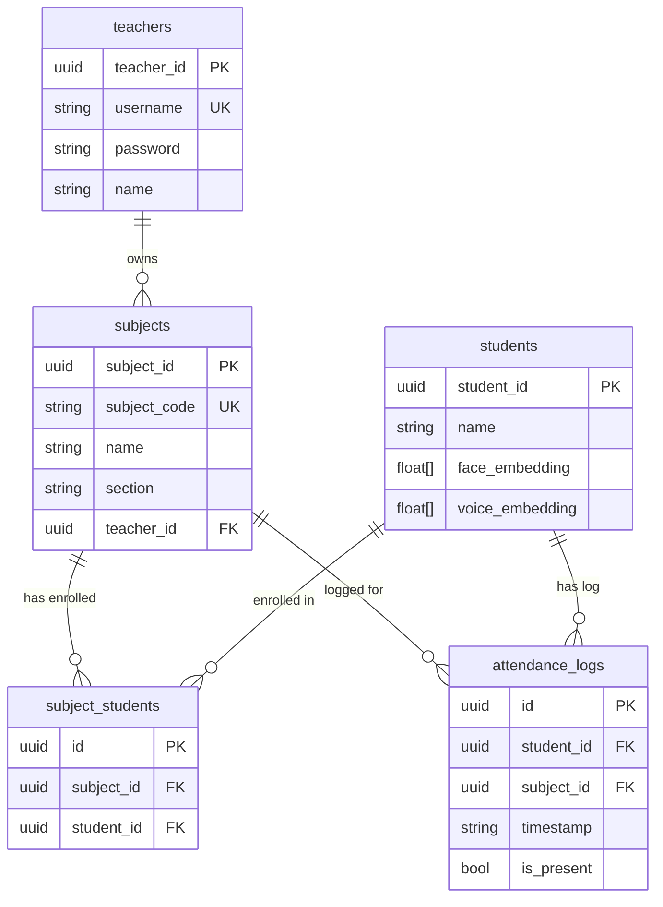
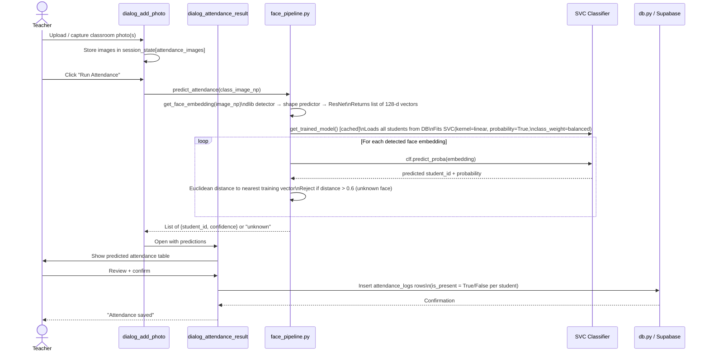
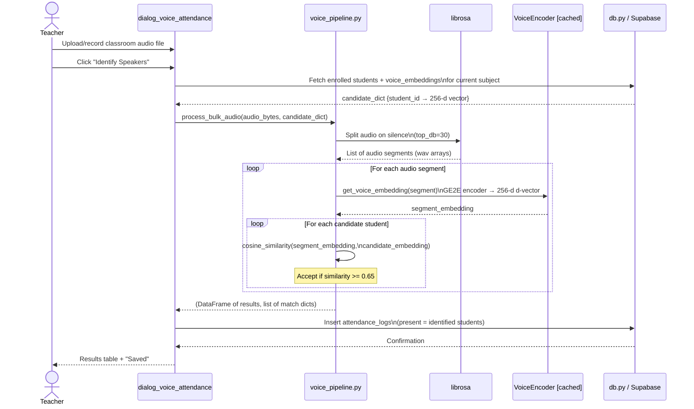
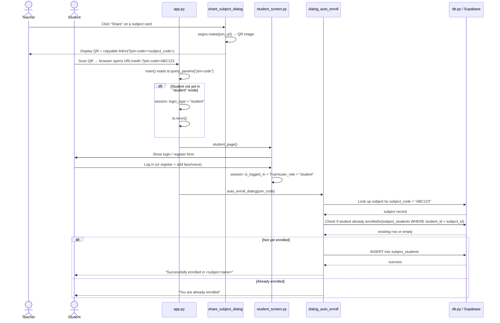
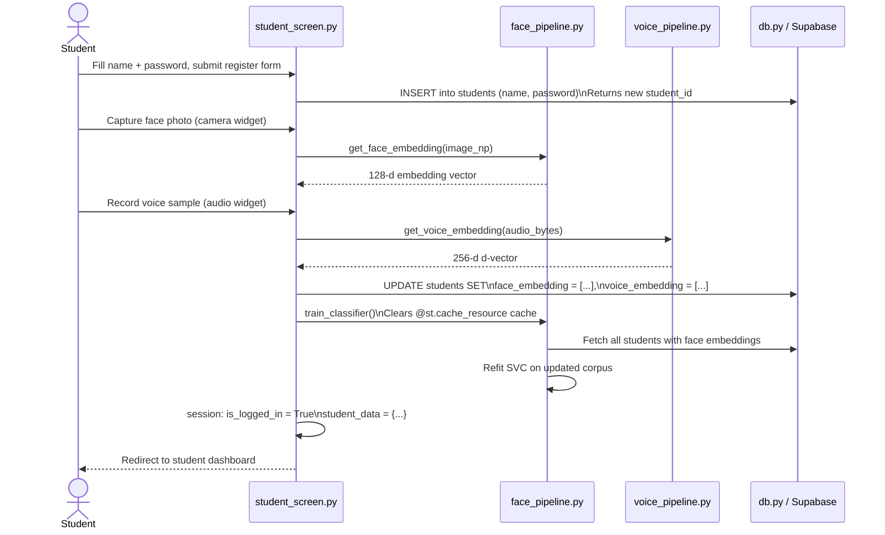

# Architecture — Smart Attendance System

## 1. System Overview

Smart Attendance System is a single-page Streamlit application that automates classroom attendance using **face recognition** and **voice recognition**. Teachers manage subjects and trigger attendance sessions; students enroll via QR codes and register their biometrics. All persistent data lives in a hosted Supabase (PostgreSQL) instance. The AI pipelines run entirely on the server process — no external ML API calls.



The architecture follows a **layered, state-machine routing** model. There are no Streamlit multipage files; navigation is driven entirely by `st.session_state['login_type']` and a `match` statement in `main()`.

---

## 2. Tech Stack

| Layer | Technology | Version | Purpose |
|---|---|---|---|
| **Web framework** | Streamlit | 1.58.0 | UI rendering, session state, routing |
| **Backend-as-a-Service** | Supabase | 2.31.0 | PostgreSQL database + REST API |
| **Auth hashing** | bcrypt | 5.0.0 | Password hashing for teacher accounts |
| **Face detection** | dlib-bin | 20.0.1 | HOG detector + 68-point shape predictor |
| **Face embedding** | face-recognition-models | 0.3.0 | Pre-trained ResNet producing 128-d vectors |
| **Face classifier** | scikit-learn | 1.9.0 | SVC (linear kernel) over enrolled embeddings |
| **Voice embedding** | resemblyzer | manual | GE2E encoder producing 256-d d-vectors |
| **Audio processing** | librosa | manual | Silence splitting for bulk audio segments |
| **Numerical ops** | NumPy | 2.4.6 | Embedding arithmetic, distance calculations |
| **Tabular data** | pandas | 3.0.3 | Attendance result DataFrames |
| **Image handling** | Pillow | 12.3.0 | PIL Image capture and conversion |
| **QR generation** | segno | 1.6.6 | QR codes for subject join links |
| **Charts** | Altair | 6.2.2 | Attendance statistics visualisations |

---

## 3. Folder Structure

```
Smart Attendance System/
├── app.py                          # Entry point — page config, main(), state-machine router
├── requirements.txt                # Pip-installable dependencies
├── PRD.md                          # Product requirements document
├── architecture.md                 # This file
├── rules.md                        # Development conventions
├── design.md                       # UI/UX design notes
├── .gitignore
│
├── .streamlit/
│   └── secrets.toml                # SUPABASE_URL, SUPABASE_SECRET_KEY (git-ignored)
│
├── assets/
│   ├── face_recognition.png        # Hero image on home/landing screen
│   └── 40-Middle-School-Student-Resize.jpg
│
└── src/
    ├── ui/
    │   └── base_layout.py          # style_base_layout() — injects global CSS design tokens
    │
    ├── components/                 # Reusable, self-contained UI fragments
    │   ├── header.py               # header_home() — top nav bar for home + student pages
    │   ├── subject_card.py         # subject_card() — card widget rendered per subject
    │   ├── dialog_create_subject.py    # @st.dialog — teacher creates a new subject
    │   ├── dialog_enroll.py            # @st.dialog — student manual enroll via join code
    │   ├── dialog_auto_enroll.py       # @st.dialog — auto-enroll triggered by QR deep-link
    │   ├── dialog_add_photo.py         # @st.dialog — capture/upload classroom photos
    │   ├── dialog_attendance_result.py # @st.dialog — review predicted attendance, confirm
    │   ├── dialog_voice_attenadance.py # @st.dialog — record audio, run voice pipeline
    │   └── share_subject_dialog.py     # @st.dialog — display QR code + copyable join link
    │
    ├── screen/                     # Top-level page controllers (one per login_type)
    │   ├── home_screen.py          # home_page() — landing / marketing / login gate
    │   ├── teacher_screen.py       # teacher_page() + teacher_dashboard()
    │   └── student_screen.py       # student_page() + student_dashboard()
    │
    ├── database/
    │   ├── config.py               # Reads secrets.toml, instantiates supabase client
    │   └── db.py                   # All CRUD operations (teachers, students, subjects,
    │                               #   subject_students, attendance_logs)
    │
    └── pipeline/
        ├── face_pipeline.py        # dlib embedding + SVC classifier + attendance prediction
        └── voice_pipeline.py       # resemblyzer embedding + cosine-similarity identification
```

---

## 4. App Flow & Routing

Navigation is a pure state machine. `main()` in `app.py` reads `st.session_state['login_type']` on every rerun and renders exactly one top-level page. Sub-page state (tabs, dialogs) is managed by additional session keys.



---

## 5. Session State Design

All routing and cross-component communication flows through `st.session_state`. No global Python variables are used for user state.

| Key | Type | Set by | Purpose |
|---|---|---|---|
| `login_type` | `None \| "teacher" \| "student"` | `app.py`, home screen | Top-level router; drives the `match` in `main()` |
| `is_logged_in` | `bool` | Teacher / student login forms | Guards dashboard rendering |
| `user_role` | `"teacher" \| "student"` | Login forms | Secondary role check (e.g. QR auto-enroll guard) |
| `teacher_auth_mode` | `"login" \| "register"` | Teacher auth form | Toggles between login and registration UI |
| `is_dashboard` | `bool` | Teacher / student screens | Controls whether the full dashboard is shown |
| `teacher_data` | `dict` | Teacher login success | Holds `{teacher_id, username, name, password}` |
| `student_data` | `dict` | Student login success | Holds `{student_id, name, face_embedding, voice_embedding}` |
| `teacher_active_tab` | `"overview" \| "attendance" \| "subjects" \| "records"` | Teacher dashboard nav | Active tab within teacher dashboard |
| `attendance_images` | `list[PIL.Image]` | `dialog_add_photo` | Staged classroom photos for face pipeline |
| `voice_attendance_results` | `(DataFrame, list[dict]) \| None` | `dialog_voice_attendance` | Results from voice pipeline, passed to result dialog |
| `open_create_subject_dialog` | `bool` | Teacher subjects tab | Trigger flag for the create-subject dialog |
| `open_add_photos_dialog` | `bool` | Teacher attendance tab | Trigger flag for the add-photos dialog |
| `photo_tab` | `"camera" \| "upload"` | `dialog_add_photo` | Active input mode inside the photo dialog |

---

## 6. Database Schema

All tables are hosted in Supabase (PostgreSQL). The application accesses them exclusively through `supabase-py` REST calls in `src/database/db.py`.



### Table Notes

- **`teachers`** — Passwords are hashed with bcrypt before storage. `username` is the login credential.
- **`students`** — `face_embedding` (128-d float array) and `voice_embedding` (256-d float array) are stored as PostgreSQL float arrays. A student can enroll in multiple subjects.
- **`subjects`** — `subject_code` doubles as the join code distributed via QR. Each subject belongs to exactly one teacher.
- **`subject_students`** — Pure join table. Enforces the many-to-many relationship between subjects and students.
- **`attendance_logs`** — One row per student per attendance session. `timestamp` is stored as text (ISO 8601). `is_present` is `True` for recognised students, `False` for logged absences.

---

## 7. AI Pipelines

### 7.1 Face Recognition Pipeline

The face pipeline lives in `src/pipeline/face_pipeline.py`. Heavy models are loaded once per server process with `@st.cache_resource` to avoid re-initialisation on every Streamlit rerun.



**Key thresholds and design decisions:**

| Parameter | Value | Rationale |
|---|---|---|
| Face embedding dimension | 128-d | dlib ResNet output (fixed) |
| Rejection threshold (Euclidean) | 0.6 | Empirically robust for classroom distances |
| SVC kernel | linear | Fast inference; embeddings are linearly separable in high-d space |
| `class_weight` | balanced | Compensates for uneven enrollment counts per student |
| Model caching | `@st.cache_resource` | One SVC instance per server; `train_classifier()` clears cache on new enrolment |

### 7.2 Voice Recognition Pipeline

The voice pipeline lives in `src/pipeline/voice_pipeline.py`. It handles both individual embedding registration and bulk multi-speaker audio for a full classroom session.



**Key thresholds and design decisions:**

| Parameter | Value | Rationale |
|---|---|---|
| Voice embedding dimension | 256-d | resemblyzer GE2E encoder output (fixed) |
| Similarity metric | Cosine similarity | Rotation-invariant; standard for speaker d-vectors |
| Acceptance threshold | ≥ 0.65 | Balances recall vs. false positives in noisy classroom audio |
| Silence splitting `top_db` | 30 | Segments utterances from ambient classroom noise |
| Encoder caching | `@st.cache_resource` | GE2E model is large; load once per process |

---

## 8. Component Architecture

Components in `src/components/` are stateless UI fragments. They read from and write to `st.session_state`; they do not call each other directly. Screens orchestrate which components are rendered.

```
app.py
└── src/screen/home_screen.py       → home_page()
    └── src/components/header.py    → header_home()

app.py
└── src/screen/teacher_screen.py    → teacher_page() → teacher_dashboard()
    ├── src/ui/base_layout.py       → style_base_layout()
    ├── src/components/subject_card.py          → subject_card()
    ├── src/components/dialog_create_subject.py → triggered by open_create_subject_dialog
    ├── src/components/share_subject_dialog.py  → triggered per subject
    ├── src/components/dialog_add_photo.py      → triggered by open_add_photos_dialog
    ├── src/components/dialog_attendance_result.py → triggered after face pipeline
    └── src/components/dialog_voice_attenadance.py → triggered from attendance tab

app.py
└── src/screen/student_screen.py    → student_page() → student_dashboard()
    ├── src/ui/base_layout.py       → style_base_layout()
    ├── src/components/header.py    → header_home()
    ├── src/components/subject_card.py     → subject_card()
    ├── src/components/dialog_enroll.py   → manual enroll
    └── src/components/dialog_auto_enroll.py → QR deep-link enroll (via app.py)
```

**Import rules:**
- `screen/` imports from `components/`, `database/`, `pipeline/`, and `ui/`.
- `components/` imports from `database/` and `pipeline/` only — never from `screen/`.
- `pipeline/` imports from `database/` (to fetch embeddings for training/identification).
- `database/config.py` has no internal imports; it is the dependency root.

---

## 9. Data Flow — Key Scenarios

### QR Deep-Link Enrollment

A teacher shares a QR code containing a URL with `?join-code=<subject_code>`. A student scans it on any device and is automatically enrolled into the subject after logging in.



### New Student Registration (Biometric Capture)

When a student registers, their face and voice embeddings are captured and stored. The face SVC is retrained to include the new student.


